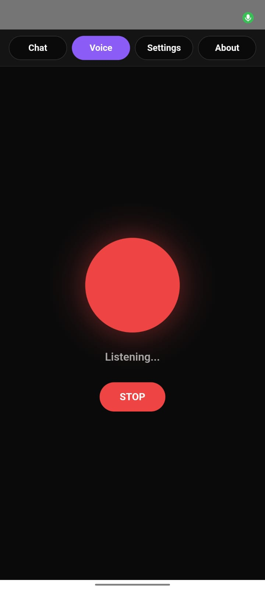
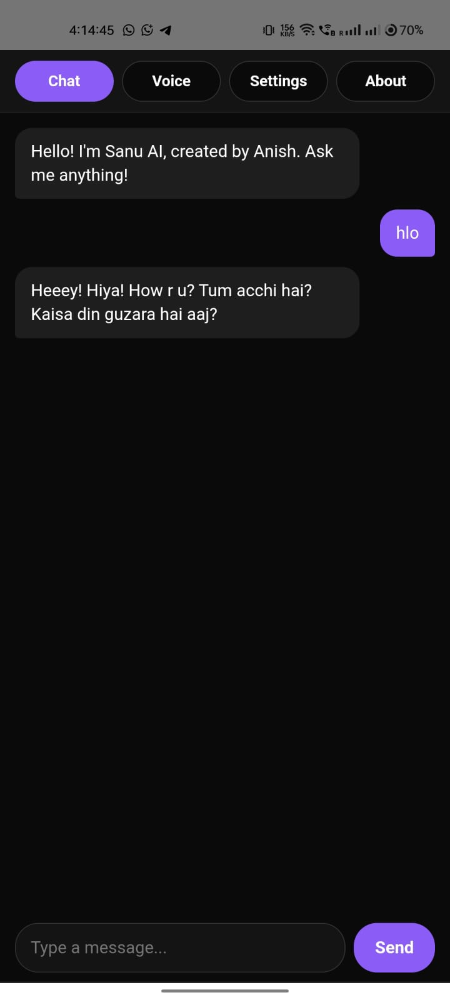

# Sanu AI - Voice Assistant App

Sanu AI is a smart voice assistant app that can chat with you and respond to your voice commands. Whether you want to have a casual chat or need quick answers, Sanu is here to help!

## 📱 Download & Install

Choose and download any of the APK files below:

### Available APK Versions:
- **Sanu-Unrestricted.apk** (4.3 MB) - Unrestricted features version

### Installation Instructions:
1. Download any APK file from above
2. Enable "Install from unknown sources" in your Android settings
3. Tap the downloaded APK file to install
4. Launch the app and enjoy!

## 🖼️ App Screenshots

## ✨ Features

- **💬 Real-time Chat with AI** - Natural conversation interface
- **🎤 Voice Recognition & Reply** - Talk to Sanu and get voice responses
- **🎵 Multiple Voice Profiles** - 10 different voices (5 female + 5 male)
- **🌐 Hindi & English Support** - Natural Hinglish conversations
- **⚡ Fast & Responsive** - Quick AI responses
- **🔒 Privacy Focused** - Your conversations stay private

## 🎭 Voice Personalities

Choose from 10 different AI voices:

### Female Voices:
- **Priya** (Sweet) - Higher pitch, friendly tone
- **Zara** (Confident) - Professional and clear
- **Maya** (Calm) - Soothing and gentle
- **Sanu** (Playful) - Energetic and fun
- **Neha** (Professional) - Clear and articulate

### Male Voices:
- **Arjun** (Friendly) - Warm and approachable
- **Dev** (Deep) - Rich and authoritative
- **Rohan** (Casual) - Relaxed and natural
- **Veer** (Bold) - Strong and confident
- **Aditya** (Smooth) - Balanced and pleasant

## 🛠️ How to Use

1. **Chat Mode**: Type messages to have text conversations
2. **Voice Mode**: Tap the orb to start voice conversations
3. **Settings**: Customize voice and language preferences
4. **About**: Learn more about the app and developer

## 📞 Support & Updates

Join our official WhatsApp channel for updates and support:
[Join WhatsApp Channel](https://whatsapp.com/channel/0029VaAWr3x5PO0y7qLfcR26)

## 👨‍💻 Developer

Created with ❤️ by **Anish**

## 📋 App Information

- **Version**: 1.0.0
- **Platform**: Android
- **Size**: ~4.2 MB per APK
- **Languages**: Hindi, English, Hinglish
- **Internet Required**: Yes (for AI responses)

## ⚠️ Important Notes

- This app requires internet connection for AI responses
- Voice recognition works best in quiet environments
- Grant microphone permissions when prompted
- Android 5.0+ recommended for best performance

---

© 2024 Sanu AI. All rights reserved.
